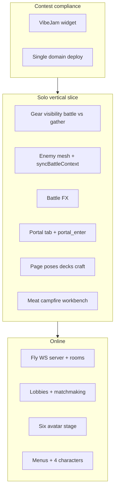

# IDLE-CRAFT — Complete contest and feature plan

Single consolidated plan combining: **Vibe Jam 2026** requirements, **Portal** tab + enter animation, **solo battle** presentation (enemies + gear rules), and the full **multiplayer / contest** roadmap (Fly, modes, lobbies, UI, characters, viewport, poses, props).

**Architecture anchors:** [GAME_MASTER.md](./GAME_MASTER.md) · [src/core/gameStore.ts](./src/core/gameStore.ts) · [src/ui/mountApp.ts](./src/ui/mountApp.ts) · [src/visual/characterScenePreview.ts](./src/visual/characterScenePreview.ts) · [index.html](./index.html) · [netlify.toml](./netlify.toml)

**Related:** [PLAN.md](./PLAN.md) (shipped checklist) · [vibejam_portal_solo_battle.md](./vibejam_portal_solo_battle.md) (jam vs repo matrix)

---

## Part A — Contest compliance and hosting

### A1. Vibe Jam 2026 entrant widget (required)

- Add to `index.html` before `</body>`:

  ```html
  <script async src="https://vibej.am/2026/widget.js"></script>
  ```

- Keep game bootstrap as `type="module"` on `/src/main.ts`; widget is a separate async script.
- **Single domain:** ship the playable build on one stable origin (custom domain on Netlify, or a dedicated Fly URL). Do not split the same build across unrelated first-party domains.

**Status:** **Done** — widget present in `index.html`; deploy discipline is operational (see `netlify.toml`).

### A2. Deploy path

- Web build: `publish = dist` in `netlify.toml`; `npm run build` produces Vite output.
- Document contest URL + widget requirement in `GAME_MASTER.md` (and deployment notes when you maintain them — optional local guide e.g. `NETLIFY_DEPLOYMENT.md` if you keep one under `C:\Docs\` or in-repo).

**Status:** **Done** (`netlify.toml`, `GAME_MASTER.md`, **`docs/DEPLOY.md`** — Netlify + Fly + CLI). In-repo `build/README.md` remains Windows/Electron icons.

---

## Part B — Multiplayer and server (Fly + End-of-Empires–style)

### B1. Research phase

- Review Fly.io deployment patterns (Dockerfile, `fly.toml`, secrets, WebSocket region) from comparable projects (e.g. GameOfEmpires / EndOfEmpires, SpaceBell).
- **Seeded world:** server owns seed + room id; clients receive seed for deterministic debugging.
- **Authority:** server validates anything competitive (PvP, shared coop economy).

**Status:** **Done (ops)** — static game on Netlify (**idle-crafting**), lobby WebSocket on Fly (`wss://idle-craft-rooms.fly.dev`), protocol v2. Further research only if you add new regions or HTTPS APIs with CORS.

### B2. Server and protocol

- Fly hosts Node (or Bun) WebSocket service: lobby, `room:{id}`, optional matchmaking queue.
- **Room:** `maxPlayers: 6`, `mode`, `seed`, phase (`lobby` → `countdown` → `running` → `ended`), player list (`id`, `name`, `character id`, `team` for 3v3, `ready`).
- **Versioned messages:** `v1:join`, `ready`, `start`, `stateDelta`, `battleAction`, etc.
- **Coop:** shared resources (server-authoritative inventory or validated intents).
- **PvP / 3v3 deathmatch:** battles resolved on Battle tab surface; no late join after countdown; server stores battle state.

**Status:** **Partial / shipped shell** — `server/room-server.mjs` is **protocol v2** (rooms, phases, seed, list/create/join, ready/lock/launch, queue stub, chat/voice relay, battleIntent stub). Deployed to Fly; client `roomHub` + lobby UI integrated. **Not done:** server-authoritative inventory, PvP battle validation, full queue matcher, `GameStore` sync across clients.

### B3. Game modes (matrix)

| Mode | Players | Resources | Battle | Matchmaking |
|------|---------|-----------|--------|-------------|
| Solo | 1 | Local `GameStore` | Local PvE | N/A |
| Coop | 2–6 | Shared | Coordinated PvE | Create / find room |
| PvP | 2–6 | Per ruleset | Battle tab | Queue + open rooms |
| 3v3 craft deathmatch | 6 (3+3) | Ruleset | Timed / battles | Queue → locked start |

**Status:** **Solo row done**; **online rows playable as parallel local runs** after lobby launch (shared room code + seed; same expedition loop per player). **Not done:** shared stash, live PvP combat vs another player’s deck, server-driven battle ticks.

### B4. Lobbies and matchmaking

- **Coop:** host creates room; join by code or browse open rooms; start when host ready.
- **PvP / deathmatch:** find-match pool; browse open rooms with slots; join only in lobby; all start together after countdown (no mid-match join for ranked modes).

**Status:** **Shipped (UX)** — browse/create/join, queue join stub, ready + host lock + launch; chat + voice in lobby. **Not done:** full auto-match pool, reconnect after `active`.

### B5. Multiplayer viewport

- Extend beyond single `CharacterScenePreview` dock: one shared stage with up to six avatars, nametags, team colors (3v3), shared lighting / `forestEnvironment.ts` patterns, LOD for remote players.

**Status:** **Done (lobby stage)** — `multiplayerAvatarStage.ts` six slots + nametags + team tint in **online lobby**. Main game dock remains single-avatar; LOD optional later.

---

## Part C — Menus, characters, solo reset

### C1. Start menu and mode flow

- New flow before current shell: **Start menu** (SpaceBell-level polish: layered panels, typography, subtle motion — “PBR-adjacent” 2D materials feel).
- **Mode picker:** Solo / Coop / PvP / 3v3 (disable online if unreachable).
- **Solo:** reset run control (confirm → `GameStore.reset()` + preview reset); persistence per design (`localStorage` — see `GAME_MASTER.md`).

**Status:** **Done** — `mountStartFlow.ts`: title → mode → character → (online lobby or enter game). Continue / New expedition on title. Solo reset also in nav. Player-facing copy avoids dev-only server instructions.

### C2. Character selection

- After mode: character select — existing avatar + **four new** characters.
- Pipeline: same procedural approach as current LPCA-style avatar in `characterScenePreview` / `characterEquipment.ts`; extend `src/core/types.ts` + `content.ts` with presets (materials, silhouette, flair).

**Status:** **Done** — eight presets in `characterPresets.ts` + `GameStore` / migrations; lobby + server validate ids.

---

## Part D — Vibe Jam–adjacent solo features (Portal + battle + gear)

### D1. Portal tab

- Add `Page 'portal'` in `mountApp.ts`; `renderPortal`; nav button.
- Extend `AppPageContext` with `'portal'`; portal idle pose in `applyPageAmbient`.
- Animation: procedural portal mesh + `portal_enter` clip (walk-in, fade/dissolve, ~2.5–4s); trigger on tab visit (default).
- Styles in `app.css`.

**Status:** **Done** — includes `PlasmaPortalLPCA`, hub redirect via `vibeJamPortal.ts` + `vibejam-portal-exit`, Portal copy clarifying “switch games only”.

### D2. Solo battle: animals / enemies on stage

**Original spec note:** “only sparks + short strike” — **superseded in repo.**

**Current implementation:**

- `syncBattleContext(enemyId)` when battle is active; procedural enemy per PvE id from `pveEnemyLPCA.ts` (rat, wolf, humanoid deserter).
- Strike / cast / enemy strike clips; lethal kill chains `battle_enemy_death`; blood VFX and damage floaters.

**Status:** **Done** for solo dock PvE presentation; **ongoing polish** (spacing, animation tuning). Server-driven battle events for online **not done**.

### D3. Weapon vs tool visibility (battle vs gather)

- Battle: weapon + shield for combat idle; hide pick / belt / mine pick / gather props.
- Gather: empty hands at idle until clip; clips show correct tool (e.g. axe for wood); no sword on idle gather.
- Inventory: optional full carry overview (`showIdleGear` + page context).

**Implementation:** `showIdleGear` / `hideGearForClip` + `setPageContext` / `pageContext` in `characterScenePreview.ts` (combat vs gather rules; no separate `applyCombatVsGatherVisibility` symbol).

**Status:** **Done** — verify edge cases when adding new tools.

### D4. Poses and props (broader polish)

- Page poses: distinct stable poses for **decks / craft / battle**; short blends on **`setPageContext`**; fixes awkward arms when switching tabs.
- Meat / hunt: **phased** clip (trap → cut → pickup) within timing budget.
- Campfire, workbench, structures: **hero** materials + **first-use** moments (particles/light).

**Status:** **Done** (solo dock); further polish always optional.

### D5. Battle FX (solo + coop; PvP later)

- Floating **damage numbers**, **hit FX** (sparks, blood layers), **enemy / player** strike reactions and death clips; structure the presentation so **future server-driven battle events** can trigger the same visuals (no full multiplayer bus required for solo).

**Status:** **Done** for solo presentation + wiring pattern; **server-side** validation and event stream **not done**.

---

## Part E — Recommended implementation order



**Suggested sequence (updated for current repo):**

1. ~~VibeJam script + deploy note~~ **(shipped)**
2. ~~Gear visibility + page poses (decks/craft/battle) + `setPageContext` blends~~ **(shipped)**
3. ~~Enemy on battle tab + battle FX + reactions (solo; server-ready presentation)~~ **(shipped)**
4. ~~Portal tab + animation~~ **(shipped)**
5. ~~Hunt/meat phased clip + campfire/workbench hero + first-use moments~~ **(shipped)**
6. ~~**Research:** Fly + seeded rooms + domain~~ **(shipped)**
7. ~~Networking → lobbies → six-up → menus + characters~~ **(shipped)** — parallel local runs after launch; **not done:** shared `GameStore` / two-client harness
8. Dispatch **server** battle events into dock (reuse solo presentation) for PvP **(not done)** — visuals are ready client-side

---

## Part F — Testing and acceptance

| Check | Target |
|-------|--------|
| Widget | No boot regression; single origin in production |
| Solo | Battle shows player + enemy; tools hidden on battle idle; gather idle no weapon; Portal animation no WebGL leak |
| Multiplayer | Six slots in lobby; launch gives fresh run + room/seed HUD; deathmatch phases on server *(shared stash / true PvP future)* |
| Contest bar | Start flow + character select + solo loop + browser-only lobby *(no player-facing dev server steps)* |

---

## Part G — Dependencies between threads

- `syncBattleContext` + enemy mesh feeds **solo now** and future **server-driven** PvP battles.
- Gear visibility rules apply to **multiplayer preview clones** (same rules per page) when built.
- **Portal** is independent; safe for jam feel.
- **Fly** and **Netlify** are complementary: static game on one domain; optional API/WebSocket on Fly subdomain with CORS/ws config — confirm after B1 research (reverse-proxy vs split domain).

---

## Part H — Executive status (quick checklist)

| Item | Status |
|------|--------|
| Research Fly + Netlify; lock transport, room lifecycle, deploy domain | **Done** (Netlify **idle-crafting** + Fly lobby WSS) |
| `vibej.am/2026/widget.js` in `index.html`; single-domain deploy; noted in `GAME_MASTER.md` | **Done** |
| Fly-hosted WS server; room model (6 players, seed, phases); protocol v2; chat/voice relay | **Done (shell)**; **Not done:** shared inventory, PvP battle authority |
| Modes solo/coop/PvP/3v3; lobby browse + queue stub; lock/start; create/find room | **Done** (parallel local expeditions after launch) |
| Start menu + mode select + character select; solo reset in flow + nav | **Done** (`mountStartFlow`) |
| Eight procedural presets + pipeline (`characterPresets`, `types`, dock) | **Done** |
| Lobby stage: up to 6 avatars + nametags/teams | **Done**; main-game dock LOD optional |
| Nav `portal`; `renderPortal`; `portal_enter` + procedural portal mesh; `app.css` | **Done** |
| Combat vs gather gear visibility; inventory full carry optional | **Done** |
| Page poses decks/craft/battle + blends on `setPageContext`; hunt phased; campfire/workbench hero + first-use | **Done** |
| `syncBattleContext`; procedural enemy; hit/react/defeat tied to PvE + cards | **Done** (solo) |
| Damage numbers, hit FX, enemy/player reactions; presentation wired for future server battle events | **Done** (solo); server stream **Not done** |

---

## Part I — Merged sources

This file merges: full contest/multiplayer roadmap + Vibe Jam / Portal / solo battle plan. Update **Part H** when shipping online or menu work; update **Part D** when solo polish changes.

*Last updated: 2026-04-13 — Part H/C/B refreshed for shipped start flow, lobby v2, eight presets, parallel online runs + `onlineSession` HUD; player-facing copy excludes dev server steps.*
