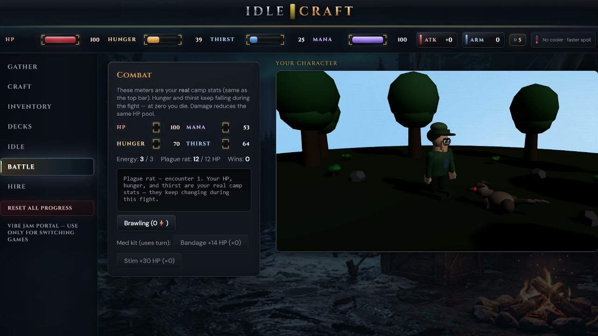

# MOBA — Magic Orbiting Brandished Atoms

> **Fork of IDLE-CRAFT** (copied from the local `idle deck` working tree, not only `git HEAD`). Same Three.js + LPCA forest/terrain/bioluminescence pipeline; this repo is being reshaped into a **classic MOBA** (3v3, trees-as-objectives, mushroom cores, MOBA-tuned movement, trimmed craft economy).

**Upstream idle game:** still developed in the sibling `idle deck` folder. **This folder** (`MOBA`) is the jam-facing title with isolated `localStorage` / IndexedDB keys so both can coexist in one browser profile.

**Vibe Jam 2026** — see [vibej.am/2026](https://vibej.am/2026) (widget + portals TBD for this deploy origin).

**Deploy (Git + Netlify + Fly):** [`docs/MOBA_HOSTING_SETUP.md`](docs/MOBA_HOSTING_SETUP.md) — **exact commands** for push, Fly, Netlify. **Repo split + post-match flow:** [`docs/MOBA_DEPLOY_REPO_AND_POST_MATCH_FLOW.md`](docs/MOBA_DEPLOY_REPO_AND_POST_MATCH_FLOW.md).

### Production (live)

| | URL |
|--|-----|
| **Play** | [moba-magic-atoms.netlify.app](https://moba-magic-atoms.netlify.app) |
| **GitHub** | [github.com/MorninRage/moba-magic-atoms](https://github.com/MorninRage/moba-magic-atoms) |
| **Lobby (WSS)** | `wss://moba-rooms.fly.dev` — HTTPS [moba-rooms.fly.dev](https://moba-rooms.fly.dev) |

**Routine ship:** `git push origin main` (if Netlify CI linked) → or `npm run deploy:netlify`; after server changes → `npm run deploy:fly` first. Full copy-paste steps in [`docs/MOBA_HOSTING_SETUP.md`](docs/MOBA_HOSTING_SETUP.md).



---

## Status

Gameplay is still the IDLE-CRAFT shell until MOBA phases land (hero select, objectives, match loop). See the migration plan in your Cursor plans / design docs.

---

## Premise (legacy copy — narrative for idle fork)

The IDLE-CRAFT premise (Vanguard, Mira, deck curse) lives in [`LORE.md`](./LORE.md) for reference; MOBA will use a separate player-facing premise as heroes and modes solidify.

---

## Features

- **Deck-driven crafting** — unlock cards to gate recipes, stations (campfire, workbench, forge, kitchen), and gather actions
- **Manual gather + idle automation** — timed 3D preview clips synced to per-action yields; idle slots run helpers passively
- **Survival vitals** — hunger, thirst, HP, mana with helper feed rules and consumables
- **Turn-based PvE battle** — energy + mana, weapons, helpers, permadeath on 0 HP, full death cinematics
- **Procedural Three.js character dock** — LPCA (Layered Procedural Construction Approach) avatar, gear meshes, page-aware poses, blood VFX, enemy procedural meshes (rat, wolf, deserter)
- **Two zero-cost cinematic cutscenes** — `intro_the_curse` (51s) + `intro_the_shattering` (76s), produced via the pipeline in [`docs/CUTSCENE_PIPELINE.md`](./docs/CUTSCENE_PIPELINE.md). _Currently unwired from the boot graph as of 2026-04-22; files preserved on disk for a one-commit revert. See [`docs/SESSION_2026_04_22_CUTSCENE_REMOVAL_AND_BOOT_TIGHTENING.md`](./docs/SESSION_2026_04_22_CUTSCENE_REMOVAL_AND_BOOT_TIGHTENING.md)._
- **Vibe Jam portal** — exit redirect to the official jam hub with `ref` / `username` / `color` / `hp` continuity params
- **Online lobby** (Fly.io WebSocket) — co-op caravans, Hunter duels, Forge clash deathmatches; chat + voice relay; up to 6 players per room

---

## Tech stack

| Layer | Choice |
|---|---|
| Language | TypeScript ~5.7 |
| Bundler / dev server | Vite 5 (port 3000) |
| 3D | `three` ^0.182 — procedural LPCA avatar, equipment, environment |
| State | `GameStore` class, `localStorage` persistence (`moba-magic-atoms-save-v1`) |
| Static deploy | Netlify [**moba-magic-atoms.netlify.app**](https://moba-magic-atoms.netlify.app) |
| Lobby server | Fly.io Node WebSocket (`wss://moba-rooms.fly.dev`) |
| Cutscenes | Pollinations FLUX + ComfyUI Depthflow + Piper TTS + Remotion (zero-cost) |

**No external 3D model files.** Every prop, character, and prop is built from Three.js primitives at runtime via the LPCA pipeline. See [`AGENT_CONTEXT.md`](./AGENT_CONTEXT.md) and [`docs/LPCA_IDLE_CRAFT_REFERENCE.md`](./docs/LPCA_IDLE_CRAFT_REFERENCE.md).

---

## Getting started

### Play in browser
Open **[moba-magic-atoms.netlify.app](https://moba-magic-atoms.netlify.app)**. Nothing to install.

### Run locally

Requires Node 22+ and npm.

```bash
npm install        # also runs `prepare`: downloads CC0 music, encodes hero WebPs
npm run dev        # http://localhost:3000
```

**3D dock (legacy vs render worker):** by default the game uses a **main-thread** Three.js preview (`CharacterScenePreview`). The **OffscreenCanvas + Web Worker** path is **opt-in** with **`?worker=1`** (requires COOP/COEP and `SharedArrayBuffer`). See **[`docs/WORKER_VS_LEGACY_PATH.md`](./docs/WORKER_VS_LEGACY_PATH.md)** for URL flags, what changed in 2026-04, and known gaps.

Optional: run the lobby server locally (otherwise the client falls back to the production WSS):

```bash
npm run rooms      # ws://localhost:3334
```

### Build for production

```bash
npm run build      # outputs dist/
npm run preview    # serve dist/ locally to spot-check
```

### Deploy

From repo root (see [`docs/MOBA_HOSTING_SETUP.md`](./docs/MOBA_HOSTING_SETUP.md) for paths and CI):

```powershell
# Client (Netlify production)
npm run deploy:netlify

# Room server (Fly) — run after protocol / server changes
npm run deploy:fly
```

**Git:** `git add -A`, `git commit -m "…"`, `git push origin main`.

Full checklist: [`docs/DEPLOY.md`](./docs/DEPLOY.md).

---

## Project layout

```
moba-magic-atoms/
├── src/
│   ├── main.ts                       # boot: title flow → click → game shell (cutscenes unwired 2026-04-22; see session doc)
│   ├── core/
│   │   ├── gameStore.ts              # all gameplay logic + persistence
│   │   └── types.ts                  # GameState, cards, recipes, battle, etc.
│   ├── data/
│   │   ├── content.ts                # cards, recipes, helpers, PvE enemies, item ids
│   │   ├── characterPresets.ts       # 8 procedural character presets
│   │   └── metalConstants.ts         # tier orders, yields, wear
│   ├── ui/
│   │   ├── mountApp.ts               # main game shell (HUD, nav, pages)
│   │   ├── mountStartFlow.ts         # title → mode → character flow
│   │   ├── mountOnlineLobby.ts       # browse/create/join + 6-avatar stage
│   │   └── tutorial/                 # first-time onboarding
│   ├── visual/
│   │   ├── characterScenePreview.ts  # Three.js dock: avatar, clips, gear
│   │   ├── characterEquipment.ts     # axe / sword / pick / shield meshes
│   │   ├── pveEnemyLPCA.ts           # rat / wolf / deserter procedurals
│   │   └── *LPCA.ts                  # other procedural builders
│   ├── world/                        # heightfield, water, lighting, weather, harvest
│   ├── audio/
│   │   ├── gameAudio.ts              # AudioContext, music transport, world SFX
│   │   └── audioBridge.ts            # lazy façade keeping audio out of main chunk
│   ├── net/
│   │   ├── roomHub.ts                # WebSocket lobby client
│   │   └── roomHubBridge.ts          # lazy façade keeping lobby out of main chunk
│   └── cutscenes/                    # splash + cutscene player overlay (NO IMPORTER as of 2026-04-22; preserved for clean revert)
├── public/
│   ├── audio/music/                  # CC0 music library
│   └── cutscenes/                    # shipped MP4 cutscenes (UNWIRED from boot 2026-04-22; preserved on disk)
├── server/                           # Fly.io lobby WebSocket server
├── assets/ui/                        # PNG sources + generated WebP backgrounds
├── scripts/
│   ├── download-default-music.mjs    # prepare-hook: fetches CC0 tracks
│   └── compress-hero-backgrounds.mjs # prepare/build hook: PNG → WebP @ q90
└── docs/                             # deep dives (LPCA, cutscenes, deploy, …)
```

---

## Documentation

The codebase is heavily documented to support agent-assisted development. Key entry points:

| Doc | What's in it |
|---|---|
| [`AGENT_START_HERE.md`](./AGENT_START_HERE.md) | Single entry point for AI/human onboarding |
| [`AGENT_CONTEXT.md`](./AGENT_CONTEXT.md) | LPCA workflow, editor + MCP integration |
| [`GAME_MASTER.md`](./GAME_MASTER.md) | Systems map: state model, gather, craft, battle, dock, audio |
| [`LORE.md`](./LORE.md) | Narrative bible: characters, palette, voice, three-act arc |
| [`PLAN.md`](./PLAN.md) | Delivered phases, battle tuning, death/UI checklist |
| [`LEARNINGS.md`](./LEARNINGS.md) | Non-trivial fixes — read before re-debugging similar issues |
| [`docs/MOBA_HOSTING_SETUP.md`](./docs/MOBA_HOSTING_SETUP.md) | **Production URLs + exact Git / Fly / Netlify commands** |
| [`docs/DEPLOY.md`](./docs/DEPLOY.md) | MOBA deploy checklist (Netlify + Fly) |
| [`docs/CUTSCENE_PIPELINE.md`](./docs/CUTSCENE_PIPELINE.md) | Zero-cost cutscene production recipe |
| [`docs/LPCA_IDLE_CRAFT_REFERENCE.md`](./docs/LPCA_IDLE_CRAFT_REFERENCE.md) | Procedural geometry pipeline |
| [`docs/MULTIPLAYER_ROADMAP.md`](./docs/MULTIPLAYER_ROADMAP.md) | Lobby/co-op/PvP roadmap |
| [`docs/WEBGPU_IDLECRAFT_ROADMAP.md`](./docs/WEBGPU_IDLECRAFT_ROADMAP.md) | Optional WebGPU plan |

Full doc index lives in [`docs/`](./docs/).

---

## Credits

- **Code & game design** — MorninRage
- **Music** — CC0 / OpenGameArt (see [`scripts/download-default-music.mjs`](./scripts/download-default-music.mjs) for sources)
- **Cutscene SFX** — CC0 / OpenGameArt (see [`docs/CUTSCENE_BUILD_LOG.md`](./docs/CUTSCENE_BUILD_LOG.md) §7)
- **Cutscene visuals** — Pollinations.ai FLUX (free, no key)
- **Cutscene narration** — Piper TTS (offline, open-source)

The **web build bundles EmpireEngine** (`empire-engine` in `package.json`) for LPC, materials, and renderer helpers — same stack as IDLE-CRAFT. For **Netlify/new repos**, `file:../EmpireEngine` only works if the clone includes the engine beside the game; see [`docs/MOBA_EMPIRE_ENGINE_CI.md`](docs/MOBA_EMPIRE_ENGINE_CI.md).

---

## License

No license file ships yet — code defaults to "all rights reserved" pending an explicit license decision. CC0 music and SFX retain their original licenses (see credits above). If you want to fork or remix, open an issue first.
