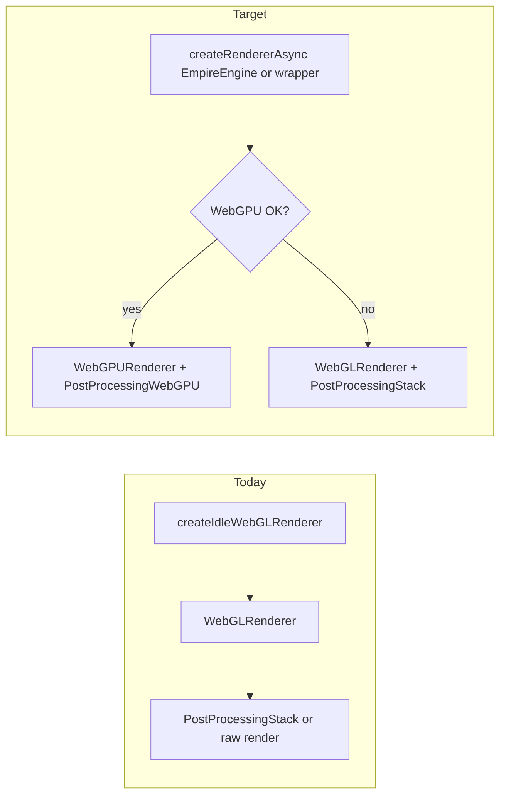

# Idle Craft WebGPU roadmap

**Status:** Planning document only — implementation not started.  
**Last updated:** 2026-04-14

This roadmap describes how to add **optional WebGPU** to Idle Craft (dual backend with WebGL fallback), reusing **EmpireEngine** renderer/post/TSL pieces where they fit, **without** syncing Game of Empires game code.

---

## Goals and constraints

- **Goal:** Offer **WebGPU when capable and desired**, with **automatic fallback to WebGL**, using the same *style* as larger engine plans (phases, audits, parity notes) but **scoped to this repo**.
- **Non-goal:** Copying or syncing `GameofEmpires` application code. Use the **`empire-engine`** package (`file:../EmpireEngine` in `package.json`) APIs only.
- **Baseline:** Idle Craft **intentionally** uses a WebGL-only bootstrap so the main bundle avoids pulling `three/webgpu` — see comments in [`src/engine/idleCraftEngine.ts`](../src/engine/idleCraftEngine.ts).

---

## Current Idle Craft rendering surface (audit)

| Area | Files / behavior | WebGPU relevance |
|------|------------------|------------------|
| Renderer entry | [`src/engine/createIdleWebGLRenderer.ts`](../src/engine/createIdleWebGLRenderer.ts), [`CharacterScenePreview`](../src/visual/characterScenePreview.ts), [`MultiplayerAvatarStage`](../src/visual/multiplayerAvatarStage.ts) | Replace with async factory returning WebGPU + `isWebGPU` when desired. |
| Post-processing | [`src/engine/postProcessingFromProject.ts`](../src/engine/postProcessingFromProject.ts) → `PostProcessingStack` (EffectComposer, SSAO/Bloom/FXAA) | **WebGL-only.** WebGPU: `PostProcessingWebGPU` (TSL) in EmpireEngine. |
| Shader compile warm-up | `renderer.compile` in `characterScenePreview.ts` | Guard remains; verify WebGPURenderer behavior. |
| Vegetation wind | [`src/visual/idleCraftVegetationWind.ts`](../src/visual/idleCraftVegetationWind.ts) — `onBeforeCompile` + GLSL | **WebGL-centric.** EmpireEngine `WindTSL` for WebGPU; dual path or temporary disable on WebGPU. |
| Celestial / VFX | [`src/world/idleCraftCelestialMaterials.ts`](../src/world/idleCraftCelestialMaterials.ts) — `ShaderMaterial` (moon, plasma) | Migrate to TSL/NodeMaterials or basic fallbacks on WebGPU. |
| Dock environment | [`src/world/idleCraftDockEnvironment.ts`](../src/world/idleCraftDockEnvironment.ts) | Moon + plasma need migration; skydome canvas + Points usually OK. |
| Night magic | [`src/visual/idleCraftNightMagicLPCA.ts`](../src/visual/idleCraftNightMagicLPCA.ts) — trails `ShaderMaterial`, fairy `onBeforeCompile` | Highest risk; TSL rewrite or reduced WebGPU mode. |
| Scene content | `MeshStandardMaterial` / `MeshPhysicalMaterial` in `characterScenePreview.ts` | Validate transmission, clearcoat, battle blood under WebGPU. |
| Graphics tier | [`src/engine/graphicsTier.ts`](../src/engine/graphicsTier.ts) | Low tier: prefer or force WebGL; desktop: optional `preferWebGPU`. |

---

## Available tech (EmpireEngine + Three.js)

- **Three.js** (project pin): `WebGPURenderer`, dynamic `import('three/webgpu')`, **TSL** for post/custom nodes.
- **EmpireEngine** (local): `createRendererAsync`, `getWebGPUCompat`, `PostProcessingWebGPU`, `createWebGPUEnvMap`, `WindTSL` — **reuse targets**, not GoE `src/`.
- **Vite:** async chunk for `three/webgpu`; keep default entry lean.
- **Testing:** Chrome/Firefox/Safari matrix; `webgpu-device-lost` (RendererFactory).

---

## Phased roadmap

### Phase 0 — Inventory and parity matrix (docs)

- Add `docs/WEBGPU_IDLECRAFT_MATRIX.md`: subsystem → WebGL → WebGPU target → phase → tests.
- Success metrics: cold start, dock FPS, hitch count, bundle delta (WebGL vs WebGPU chunk).

### Phase 1 — Renderer abstraction and bundle strategy

- New **`createIdleCraftRendererAsync`** under `src/engine/`: wrap EmpireEngine `createRendererAsync`; honor user setting + `getWebGPUCompat()` + `graphicsTier`.
- Returns `{ renderer, isWebGPU, THREE }` (`three` vs `three/webgpu`).
- Update `idleCraftEngine.ts` exports; Vite `manualChunks` / dynamic import boundary.

### Phase 2 — Post-processing dual path

- WebGL: `PostProcessingStack` unchanged.
- WebGPU: `PostProcessingWebGPU` mapped from `project.json` `postProcessing` (FXAA/vignette first; bloom/SSAO per engine).
- Call sites: `postProcessing.render()` vs raw `renderer.render()` when no active passes.

### Phase 3 — Environment and lighting parity

- `scene.environment`: `createWebGPUEnvMap()` when WebGPU.
- Moon + plasma: TSL or temporary basics behind `isWebGPU`.
- Shadows aligned with `graphicsTier`.

### Phase 4 — Vegetation wind

- WebGL: keep current wind.
- WebGPU: **WindTSL** integration **or** gate wind off until done (similar to `enableVegetationWind` on low tier).

### Phase 5 — Night magic and advanced materials

- Trails / ShaderMaterial → TSL or stub.
- Fairy NodeMaterial or reduced instancing on WebGPU.
- Battle blood / physical materials: regression pass.

### Phase 6 — UX and rollout

- Settings: Auto / WebGL / WebGPU + `localStorage`.
- Device-lost → reload prompt.
- Link matrix from `AGENT_CONTEXT.md` or `.agent/00_READ_FIRST.md` when work starts.

---

## Implementation checklist (when you start)

- [ ] Phase 0: `WEBGPU_IDLECRAFT_MATRIX.md`
- [ ] Phase 1: `createIdleCraftRendererAsync` + Vite chunking + both preview entry points
- [ ] Phase 2: dual post factory + bypass behavior
- [ ] Phase 3: env map + celestial migration
- [ ] Phase 4: wind dual path or gate
- [ ] Phase 5: night magic + material fixes
- [ ] Phase 6: settings + docs links

---

## Risk summary

| Risk | Mitigation |
|------|------------|
| Bundle size | Async `three/webgpu`; mobile stays WebGL-first. |
| Night magic | Phase 5 last; “reduced” WebGPU mode acceptable. |
| Post parity | Document SSAO/bloom gaps vs WebGL. |

## Explicitly out of scope for early phases

- Copying `GameofEmpires` `src/` or sync scripts.
- IndirectBatchedMesh / full terrain SDF (GoE-scale) unless Idle needs them later.

---

## Optional external references (patterns only)

- `GameofEmpiresDocs/docs/WEBGPU_IMPLEMENTATION_PLAN.md` — phase checklist style.
- `EmpireEditor/docs/EMPIRE_ENGINE_MASTER_PLAN.md` — long-term compute / engine vision.
