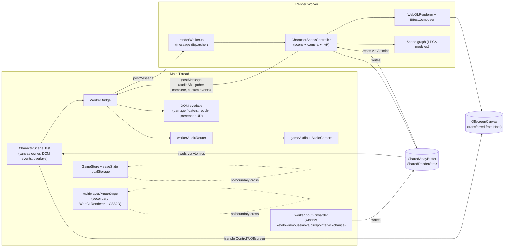

# Worker Architecture (OffscreenCanvas + SharedArrayBuffer)

> **Scope**: this document is the canonical map of the render-worker
> migration. Read this before touching any file under `src/worker/` or
> wiring scene state across the worker boundary.

## Goal

Move the entire Three.js scene (renderer + camera + scene graph + rAF
loop + post-processing) into a dedicated Web Worker. Free the main thread
to handle DOM, audio, input listeners, and `GameStore` mutations
exclusively.

Targets all three pain points called out in the migration plan:
preload wall-clock, in-game frame jank, title-screen smoothness.

**Product scope / default:** **Legacy** main-thread `CharacterScenePreview` is the default dock. The worker path is **opt-in** with **`?worker=1`** on capable browsers (see [WORKER_VS_LEGACY_PATH.md](WORKER_VS_LEGACY_PATH.md)). The ordered checklist remains **solo-first** (awakened + dock on the worker when enabled). Lobby / multiplayer / `syncOnlinePresence` stay on main-thread carve-outs until a **separate** multiplayer milestone — they are not gates for Phase 3.x in [WORKER_MIGRATION_PHASE_3X.md](WORKER_MIGRATION_PHASE_3X.md).

**Implementation checklist (ordered):** [WORKER_MIGRATION_PHASE_3X.md](WORKER_MIGRATION_PHASE_3X.md) — Steps 1–2 are the first concrete coding targets after this architecture doc; update checkboxes there as work lands.

**Default, URL flags, runtime cost:** [WORKER_VS_LEGACY_PATH.md](WORKER_VS_LEGACY_PATH.md). **Honest product vs code status (gaps: shadow preload, sky/time-of-day, camera framing):** [GAME_VISION_VS_IMPLEMENTATION_2026_04.md](GAME_VISION_VS_IMPLEMENTATION_2026_04.md).

## Two threads, one game



## Module map

### Worker side (`src/worker/`)

| File | Role |
|------|------|
| `AGENTS.md` | Hard rules for everything in the folder (no DOM, no audio, no localStorage, no GameStore) |
| `protocol.ts` | Typed `WorkerMessage` (main → worker) + `MainMessage` (worker → main) discriminated unions. Adding a new variant fails the build until both sides handle it. |
| `sharedState.ts` | `SharedRenderState` class — `SharedArrayBuffer` + typed accessors using `Atomics.load/store/add/exchange/compareExchange`. |
| `capabilityGate.ts` | Probes `OffscreenCanvas`, `transferControlToOffscreen`, `SharedArrayBuffer`, `crossOriginIsolated`. Smoke-tests Atomics round-trip. Exposes result at `globalThis.idleCraft.worker`. |
| `renderWorker.ts` | Worker entrypoint. Receives `init`, constructs `CharacterSceneController`, dispatches messages. |
| `characterSceneController.ts` | Worker-side scene owner. Holds `THREE.Scene`, `THREE.PerspectiveCamera`, `WebGLRenderer`, dock environment, forest tickers, post stack. Runs rAF; **writes live `SharedRenderState` each frame** (avatar, camera, staff tip, water bank, tone exposure, flags; gather clip fields stubbed until worker runs clips). |
| `bootstrapDockSceneSlice.ts` | Dock skydome + `IdleCraftDockEnvironment` bootstrap + terrain/water slice attach (`attachWorkerDockTerrainWaterSlice`). |
| `attachWorkerDockHeroLpcaSlice.ts` | Vanguard dock hero LPCA + solo camera + staff orb VFX; exposes `avatar` + `vanguardWizardStaffRoot` for SAB staff-tip sync. |
| `workerBridge.ts` | Main-side facade. Spawns the worker, transfers the canvas, sends typed messages. Mirrors the `CharacterScenePreview` setter API for mechanical migration. |

### Main side (worker-aware)

| File | Role |
|------|------|
| `src/visual/characterSceneHost.ts` | Main-thread shell. Creates the DOM `<canvas>`, transfers control, hosts DOM overlays. Public API mirrors `CharacterScenePreview` so callers swap with a one-line factory change. |
| `src/audio/workerAudioRouter.ts` | Routes worker-emitted `audioSfx` messages to `audioBridge.ts` calls (e.g. `playFootstepSound`). |
| `src/world/workerInputForwarder.ts` | Attaches window keyboard / pointerlock / mouse listeners; mirrors state into `SharedRenderState` via `Atomics`. |
| `src/main.ts` | Calls `probeWorkerCapabilities()` + `verifyAtomicsRoundTrip()` early in boot. |

### Stays on main (carve-outs)

| File | Why it stays |
|------|--------------|
| `src/visual/multiplayerAvatarStage.ts` | Uses `CSS2DRenderer` for crisp HTML nametags. CSS2D requires DOM. Has its own secondary `WebGLRenderer`. |
| `src/world/damageFloaters.ts` | DOM `<span>`s positioned each frame. Reads camera state from `SharedRenderState`. |
| `src/world/magicalReticle.ts` | DOM/SVG overlay. Reads camera forward from `SharedRenderState`. |
| `src/audio/gameAudio.ts` | Web Audio API requires main thread. |
| `src/core/gameStore.ts` + `saveState` | `localStorage` is main-only. Worker does NOT import `GameStore`; state arrives as `WorkerMessage` payloads. |
| `src/engine/persistentCache.ts` | Service worker registration + `navigator.storage`. Main-only. |
| `src/engine/graphicsTier.ts` | `window.matchMedia` + `localStorage` + `navigator`. Resolved tier passed to worker via `init.graphicsTier`. |

## SharedRenderState slot layout

See `src/worker/sharedState.ts` for the canonical definitions
(`F32_SLOT`, `I32_SLOT`, `FLAG`, `KEY_BIT`).

| Direction | Slot | Field | Read pattern |
|-----------|------|-------|--------------|
| worker → main | `f32[0..2]` | Avatar XYZ | Main per-frame projection |
| worker → main | `f32[3..5]` | Camera yaw / pitch / zoom | Main per-frame |
| worker → main | `f32[6..7]` | Camera forward XZ | Main per-frame |
| worker → main | `f32[8..10]` | Staff tip XYZ | Main per-frame VFX |
| worker → main | `f32[11..13]` | Gather progress + clip duration + sfx delay | Main on demand |
| worker → main | `f32[14..15]` | Water bank XZ | Main on demand |
| worker → main | `f32[16]` | Tone mapping exposure | Main on demand |
| worker → main | `f32[17..19]` | Camera world XYZ | DOM projection (floaters) |
| worker → main | `f32[20]` | Camera FOV (degrees) | Same |
| worker → main | `f32[21]` | Camera aspect (w/h) | Same |
| both | `i32[0]` | Flags bitmask | Both, atomic OR/AND |
| main → worker | `i32[1..2]` | Mouse delta XY (fx16) | Main: `Atomics.add` per event. Worker: `Atomics.exchange(_, 0)` per frame. |
| main → worker | `i32[3]` | Wheel delta Y | Same accumulate-and-drain |
| main → worker | `i32[4]` | Keyboard state bitmask | Main: atomic OR/AND on keydown/keyup. Worker: `Atomics.load` per frame. |
| main → worker | `i32[5]` | Mouse buttons bitmask | Same |
| main → worker | `i32[6]` | Pointer-lock active flag | Main: store on `pointerlockchange`. Worker: load per frame. |
| worker → main | `i32[7]` | Frame counter | Main reads for liveness check |
| worker → main | `i32[8]` | Last render timestamp ms | Main reads for stall detection |

Total: 1024 f32 bytes + 256 i32 bytes = **1280 bytes** per worker.

## Why `SharedArrayBuffer` instead of postMessage state mirroring

`CharacterScenePreview` exposes 60+ getters (`getAvatarGroundXZ`,
`getCameraForwardXZ`, `getCameraYawPitch`, `getStaffTipWorldPosition`,
`getGatherClipProgress01`, etc.). Main calls these per-frame from:
- `mountApp.frame()` for game systems
- `damageFloaters.update()` for DOM projection
- `magicalReticle.setVisible/setMode` for aim state
- HUD `innerHTML` rebuilds on store changes

postMessage round-trip would queue these reads on the receive side and
return values 1 frame stale. SAB lets main read worker-written state via
`Atomics.load` synchronously with no IPC.

`Atomics.wait` is forbidden on the main thread (it freezes UI). Polling
reads are sufficient — the game loop already polls every frame.

## Why COOP/COEP `credentialless` (not `require-corp`)

`SharedArrayBuffer` requires cross-origin isolation. Two ways to enable:

| Header value | Tradeoff |
|--------------|----------|
| `Cross-Origin-Embedder-Policy: require-corp` | Strictest. Every cross-origin resource must send `Cross-Origin-Resource-Policy: cross-origin`. Breaks Google Fonts and the vibejam widget. |
| `Cross-Origin-Embedder-Policy: credentialless` | Allows cross-origin no-credentials resources without each origin needing CORP headers. Matches our actual loading pattern. |

We use `credentialless`. Set in `netlify.toml` (production) and
`vite.config.ts` (dev server).

Browser support for `credentialless`: Chrome 96+, Edge 96+, Firefox 110+,
Safari 17.4+. Older Safari falls through the capability gate to the
legacy main-thread render path.

## Hard rules for worker code

These are also stated in `src/worker/AGENTS.md` — repeated here for the
canonical doc:

1. **NO DOM**. No `document`, `window`, `HTMLElement`,
   `HTMLImageElement`, `createElement`, `querySelector`. Use
   `OffscreenCanvas`, `OffscreenCanvasRenderingContext2D`,
   `createImageBitmap`, and `fetch` instead.
2. **NO Web Audio**. `AudioContext` is main-only. Post `audioSfx`
   messages and let `workerAudioRouter` consume.
3. **NO localStorage / sessionStorage**. `idbCache` (IndexedDB) IS
   available in workers; persistence still happens on main via
   `GameStore.saveState`.
4. **NO direct GameStore access**. State arrives as `WorkerMessage`
   payloads; state goes back via `SharedRenderState`.
5. **rAF inside worker**: `globalThis.requestAnimationFrame` works when
   bound to an `OffscreenCanvas`. Do not `setTimeout`-loop.

## Adding a new state-mutating method

Three steps:

1. Add a variant to `WorkerMessage` in `src/worker/protocol.ts`:
   ```ts
   export interface SetSomeStateMessage {
     type: 'setSomeState';
     value: number;
   }
   ```
   And include it in the `WorkerMessage` union below.

2. Add a method to `WorkerBridge` (`src/worker/workerBridge.ts`):
   ```ts
   setSomeState(value: number): void {
     this.send({ type: 'setSomeState', value });
   }
   ```

3. Add a case to `CharacterSceneController.handleMessage`
   (`src/worker/characterSceneController.ts`):
   ```ts
   case 'setSomeState':
     this.someStateField = msg.value;
     return;
   ```

If you skip any step, the TypeScript build fails on the exhaustive
switch in either `renderWorker.ts` or `characterSceneController.ts`.

## Adding a new live getter

If main needs to read worker-produced state per-frame:

1. Add an `F32_SLOT` or `I32_SLOT` index to `src/worker/sharedState.ts`.
2. Add typed getter(s) on `SharedRenderState` (e.g. `getFoo()`).
3. In `CharacterSceneController.update()`, write the slot each frame.
4. In `CharacterSceneHost`, expose a public method that reads the slot.

Pattern keeps call sites identical to the legacy
`CharacterScenePreview` getters — drop-in for migration.

## Adding worker→main events

For sparse, event-shaped traffic (audio SFX, gather completion, custom
window events) that don't need per-frame freshness:

1. Add a variant to `MainMessage` in `protocol.ts`.
2. Worker calls `controller.emit({ type: 'audioSfx', kind: 'foo' })`.
3. Main handles it in `WorkerBridge.handleMainMessage` switch.

Frequency budget: postMessage is 50-200μs per round-trip. Anything
called per-frame should use SAB instead.

## Migration status (Phase 3.x)

**Roadmap (ordered):** [WORKER_MIGRATION_PHASE_3X.md](WORKER_MIGRATION_PHASE_3X.md)

**Phase 3.x MVP (when `?worker=1`):** Worker builds full dock GL + `syncSharedRenderState`; preload can use `CharacterSceneHost`; extended attach / shadow-handoff details vary by phase — see [WORKER_MIGRATION_PHASE_3X.md](WORKER_MIGRATION_PHASE_3X.md) Step 3. Damage floaters read SAB when `WorkerBridge` registers it; **keyboard / pointer-lock / mouse deltas** attach via `CharacterSceneHost` + [`workerInputForwarder.ts`](../src/world/workerInputForwarder.ts) when host is used (detached on dispose).

**Legacy high-level phases (historical scaffold):** Phase 0–6 ✅ (foundations through lobby carve-out). **Phase 7** in that numbering = parity audit — **not done**; treat as **Phase 3.x-B** in the Step checklist.

**Default player path (2026-04-22+):** **Legacy** main-thread `CharacterScenePreview` for dock + awakened — see [WORKER_VS_LEGACY_PATH.md](WORKER_VS_LEGACY_PATH.md). Worker is **opt-in** (`?worker=1`).

## Phase 3.x-B backlog (next sessions)

- Worker: dream/gather/battle message bodies in `CharacterSceneController` (many stubs); audio SFX (Step 8); drop duplicate main+worker scene work where possible.
- Optional product decision: make worker the default after parity; strict incapable-browser UX (Steps 10–11).
- Remove or demote legacy-only branches only after parity release.
